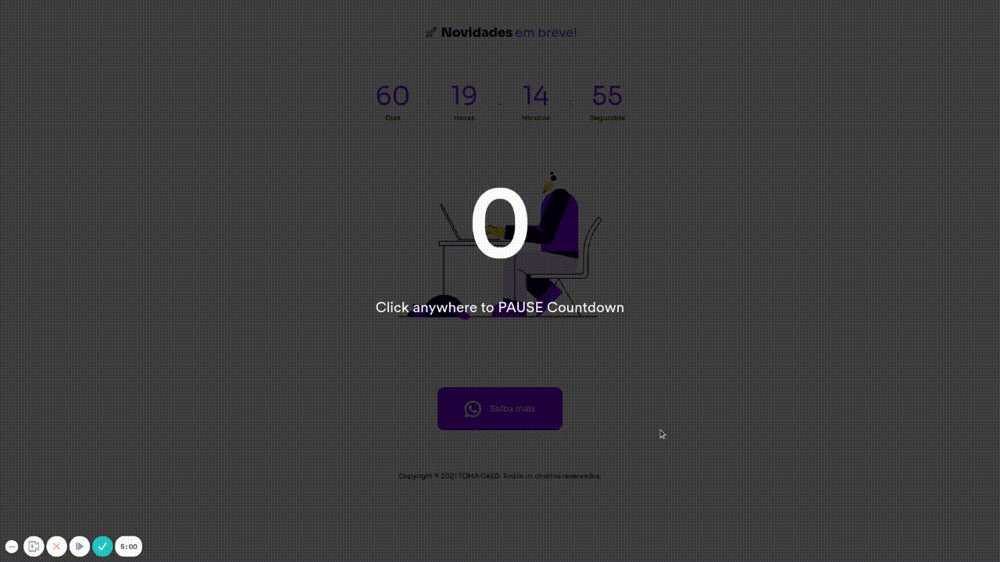

<div align=center>

<h3>

Contagem regressiva para o lançamento do site da Tomacred, com **NextJS**, **Sass** e **Lottie**.

</h3>

<br>



</div>


### 📌  **Tecnologias utilizadas**
- Next.JS
- Sass
- Lottie

<br>

### 🚀 **Mão na massa**

```bash
# Clone este repositório
$ git clone https://github.com/Joao-Augusto-Oliveira/previewtomacred

# Acesse a pasta do projeto no terminal/cmd
$ cd previewtomacred

# Instale as dependências
$ yarn

# Execute a aplicação em modo de desenvolvimento
$ yarn dev


```

<br>
<br>

<h3 align="center">
Feito com 💜 por <a href="https://www.linkedin.com/in/joão-augusto-oliveira-dos-santos-9b0693195">João Augusto
</h3>


